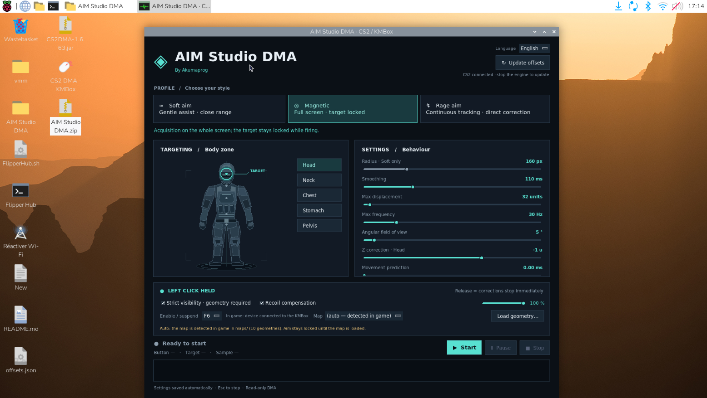

<div align="center">

# AIM Studio DMA
### By Akumaprog

**Une interface Linux pour piloter votre installation CS2 · DMA · KMBox**

[🇫🇷 Français](README.md) · [🇬🇧 English](README-en.md) · [🇪🇸 Español](README-es.md) · [🇩🇪 Deutsch](README-de.md) · [🇮🇹 Italiano](README-it.md) · [🇵🇹 Português](README-pt.md)

[Installation](#installation) · [Branchements](#branchements) · [Utilisation](#utilisation) · [Dépannage](#dépannage)

</div>
<center></div></div>center>

---

## Présentation

AIM Studio DMA rassemble le choix du profil, les réglages, le contrôle du moteur
et la mise à jour des offsets dans une interface native. L'ouverture du menu ne
démarre pas le moteur : vous gardez la main avec **Démarrer**, **Suspendre** et **Arrêter**.

- Trois profils : **Soft**, **Magnétique**, **Rage**.
- Cinq zones : tête, cou, poitrine, ventre, bassin.
- Réglages du rayon, du lissage, de la fréquence et du déplacement maximal.
- Options de compensation du recul et de visibilité géométrique.
- Lecture automatique de la sensibilité du jeu par défaut.
- Détection automatique du port KMBox lorsqu'un seul périphérique compatible est présent.
- Six langues, préférences enregistrées et journal intégré.
- Installation automatique des dépendances, isolées dans le dossier de l'application.

## Matériel et système requis

| Élément | Prérequis |
| --- | --- |
| Machine de contrôle | Raspberry Pi sous Raspberry Pi OS **64 bits**, ou PC Linux **x86-64** sous Debian/Ubuntu avec bureau graphique |
| Machine de jeu | PC exécutant CS2, équipé de la carte DMA compatible avec votre installation |
| Carte DMA | Carte FPGA prise en charge par LeechCore/MemProcFS ; l'installation USB fournie cible le pont **FT601, VID 0403 / PID 601f** |
| KMBox | Modèle B/VerB ou B Pro exposant une console série compatible avec les commandes `km.*` utilisées ici |
| Connexions | Câbles USB **de données**, ports et alimentation adaptés aux appareils |
| Premier lancement | Internet, accès aux dépôts système/PyPI/GitHub, droits `sudo` |

Le logiciel livré est une application **Linux**. Il ne s'installe pas directement
sous Windows ou macOS. Un OS ARM 32 bits n'est pas pris en charge.
La référence testée dans le projet est une **KMBox VerB, firmware 10.3.0, à 115200 bauds**.
La compatibilité d'une B Pro dépend de son firmware : le nom commercial seul ne
garantit pas que sa console propose le même protocole. Une KMBox Net n'est pas
un remplacement direct pour cette liaison série.

## Branchements

### 1. Carte DMA

1. Éteignez et débranchez le PC de jeu avant d'installer la carte PCIe, selon la notice du fabricant.
2. Installez la carte dans un emplacement compatible, puis refermez et remettez le PC sous tension.
3. Reliez le **port USB de transfert DMA** à la machine Linux de contrôle, avec un câble de données adapté.
4. Si la carte possède un port de programmation séparé, identifiez-le dans sa notice : il ne remplace pas le port de transfert.
5. La carte doit disposer d'un firmware fonctionnel et être reconnue par LeechCore/MemProcFS.

Le logiciel n'installe et ne flashe pas le firmware FPGA. Les procédures de
programmation, d'alimentation et de configuration de la machine hôte sont propres
au modèle de carte : utilisez la documentation de son fabricant. Le pilote USB
installé sur Linux ne suffit pas, à lui seul, à rendre toute carte compatible.

### 2. KMBox B Pro / VerB

Les noms des ports varient selon les révisions ; repérez leur **fonction** dans la notice.

1. Branchez la souris sur l'entrée périphérique de la KMBox.
2. Pour utiliser les touches F6 à F9 depuis le jeu, branchez aussi le clavier sur l'entrée prévue à cet effet, si votre modèle le permet.
3. Reliez la sortie USB HID de la KMBox au **PC de jeu**.
4. Reliez son port de contrôle série à la **machine Linux**.
5. Vérifiez que la souris fonctionne normalement sur le PC de jeu avant de démarrer le moteur.

```text
PC de jeu ← PCIe → Carte DMA ← USB de transfert → Machine Linux
PC de jeu ← USB HID → KMBox  ← USB série       → AIM Studio DMA
                      ↑
                Souris / clavier
```

Le moteur attend une console comprenant notamment `km.move`, `km.left` et les
commandes de lecture des touches. L'ouverture du port peut redémarrer la KMBox :
le logiciel attend sa console jusqu'à **25 secondes**. Ne laissez pas un moniteur
série ou un autre outil KMBox ouvert sur le même port.

### 3. Pilotes et dépendances

**Vous n'avez pas à télécharger ces composants manuellement : le lanceur les installe.**

| Composant | Installation automatique |
| --- | --- |
| Interface et environnement Python | `python3`, `python3-venv`, `python3-tk` |
| Compilation si aucun paquet binaire n'est disponible | `build-essential`, `python3-dev`, `libusb-1.0-0-dev` |
| Support USB et système | `libusb-1.0-0`, `libudev1`, `util-linux`, `ca-certificates` |
| Modules Python | `memprocfs==5.18.10`, `leechcorepyc==2.23.3`, `pyserial==3.5` |
| Bibliothèques natives DMA | Archive officielle MemProcFS 5.18.11 adaptée à ARM64/x86-64, vérifiée par SHA-256 |
| Transport FT601 | `leechcore_ft601_driver_linux.so`, extrait avec les bibliothèques natives |
| Permissions USB/série | Règles udev pour FT601 `0403:601f` et interfaces série WCH `1a86` |

Sur Linux, les interfaces série USB compatibles sont généralement prises en charge
par le noyau (`ch341`, `cdc_acm`, selon le périphérique). Aucun installateur de
pilote Windows CH340/CH341 ou FTDI n'est nécessaire sur la machine Linux.
Un périphérique avec un autre identifiant USB peut nécessiter des permissions adaptées.

## Installation

### Premier lancement

1. Sur GitHub, choisissez **Code → Download ZIP**, puis extrayez entièrement l'archive sur la machine Linux.
2. Gardez le dossier dans un emplacement accessible en écriture, par exemple votre dossier personnel ou le Bureau.
3. Ouvrez **AIM Studio DMA.desktop**. Selon le bureau Linux, autorisez d'abord son exécution via **Propriétés → Permissions**, puis **Autoriser le lancement** si demandé.
4. Un terminal affiche la préparation. Saisissez le mot de passe système si `sudo` le demande et laissez l'installation se terminer.
5. Le menu s'ouvre et un raccourci **AIM Studio DMA** est ajouté aux applications et au Bureau lorsque celui-ci est disponible.
6. Après la première installation des règles USB, débranchez/rebranchez les connexions USB si les appareils ne sont pas encore accessibles.

Si votre gestionnaire de fichiers ne lance pas les fichiers `.desktop`, ouvrez un
terminal **dans le dossier extrait** et exécutez :

```bash
bash START.sh
```

**Un seul lancement prépare le logiciel ; aucun téléchargement manuel supplémentaire
n'est prévu. Une connexion Internet reste nécessaire à cette première installation.**
Ce dépôt n'est pas un paquet universel hors ligne : les dépendances sont choisies
et téléchargées pour votre système. Les lancements suivants réutilisent l'installation.
Si l'installation est interrompue, relancez le même lanceur pour reprendre.
Sur certaines configurations ARM64, MemProcFS et LeechCore sont compilés automatiquement :
cette première installation peut prendre plusieurs minutes.

### Lancements suivants

Utilisez **AIM Studio DMA.desktop** dans le dossier ou le raccourci installé.
Le lanceur fourni dans le dossier retrouve automatiquement `START.sh` : vous pouvez
déplacer ou renommer le dossier complet, y compris dans un chemin contenant des espaces.
Gardez le lanceur, `START.sh` et `release/` ensemble.
Les raccourcis externes créés sur le Bureau et dans les applications référencent
l'emplacement d'installation ; après un déplacement, utilisez le lanceur du dossier.

## Utilisation

1. Branchez les appareils et ouvrez CS2 sur le PC de jeu.
2. Fermez les autres logiciels utilisant la même carte DMA ou le port série KMBox.
3. Ouvrez AIM Studio DMA et sélectionnez votre langue en haut à droite.
4. Choisissez un profil, une zone du corps et vos réglages.
5. Entrez dans une partie avec un joueur vivant, puis cliquez sur **Démarrer**.
6. Consultez le journal pour vérifier la connexion DMA, la KMBox et le chargement de la carte.

| Commande | Action |
| --- | --- |
| Démarrer | Lance le moteur avec les réglages du menu |
| Clic gauche physique maintenu | Autorise les corrections ; le logiciel n'envoie pas de clic de tir |
| Suspendre / Réactiver | Bascule l'assistance depuis le menu |
| F6 par défaut | Bascule l'assistance ; F7/F8/F9/Souris 4/Souris 5 sont également proposés |
| Arrêter | Arrête le moteur et libère les périphériques |
| Échap dans le menu | Demande l'arrêt |
| Fermer la fenêtre | Arrête les processus lancés par le menu |

Arrêtez le moteur avant de modifier ses réglages. Pour recevoir un raccourci
physique pendant le jeu, le périphérique concerné doit passer par la KMBox.
Les préférences et la langue sont mémorisées localement.

### Profils et géométrie

- **Soft** : acquisition dans un rayon autour du réticule, avec lissage réglable.
- **Magnétique** : acquisition à l'écran et conservation de la cible pendant le tir.
- **Rage** : acquisition à l'écran avec des réglages de correction plus directs.

Dix géométries sont incluses : Ancient, Anubis, Cache, Dust2, Inferno, Mills,
Mirage, Nuke, Train et Vertigo. Les caches d'accélération `.bvh` sont générés
localement ; le premier chargement peut prendre davantage de temps.
La vérification géométrique dépend de la correspondance entre les fichiers et la
version actuelle de la carte. Thera n'est pas incluse : le fichier disponible était invalide.

### Sensibilité, résolution et port série

Au premier lancement, `release/aim-settings.conf` est créé depuis le modèle fourni.

```ini
PORT=auto
BAUD=115200
WIDTH=1920
HEIGHT=1080
SENSITIVITY=0
M_YAW=0.022
M_PITCH=0.022
DEVICE=fpga
```

- **SENSITIVITY=0** : utilise la sensibilité lue dans le jeu. Aucune calibration personnelle du développeur n'est distribuée.
- Une sensibilité explicite force cette valeur. Si la lecture automatique est invalide, le moteur ignore les mouvements et le signale.
- Adaptez **WIDTH / HEIGHT** à la résolution du jeu.
- **PORT=auto** convient lorsqu'un seul port compatible est présent. Sinon, indiquez son chemin stable `/dev/serial/by-id/...`.
- `M_YAW` et `M_PITCH` sont des coefficients distincts de la sensibilité ; le zoom ou des réglages d'entrée particuliers peuvent modifier la conversion effective.

### Après une mise à jour de CS2

Arrêtez le moteur, fermez les autres clients DMA et ouvrez une partie avec un
joueur vivant. Cliquez sur **Mettre à jour les offsets**. L'outil recherche les
adresses, vérifie les lectures et remplace `offsets.json` après validation.
Une copie précédente est conservée en `.bak`. Si la validation échoue, les
anciennes valeurs restent en place : certaines mises à jour nécessitent une
adaptation du logiciel, pas seulement des offsets.

## Dépannage

| Symptôme | À vérifier |
| --- | --- |
| Le lanceur s'ouvre dans un éditeur | Autorisez l'exécution ou lancez `bash START.sh` depuis le dossier |
| Échec de téléchargement | Internet, accès à PyPI/GitHub/dépôts APT ; relancez pour reprendre |
| OS ou processeur refusé | Debian/Ubuntu/Raspberry Pi OS 64 bits, ARM64 ou x86-64 |
| KMBox absente / plusieurs ports | Câble de données, bon port de contrôle, puis `PORT` dans la configuration |
| KMBox ne répond pas | Firmware compatible `km.*`, baudrate, absence d'autre moniteur série ; attendre jusqu'à 25 s |
| Permission USB refusée | Rebranchez l'appareil après installation ; vérifiez son identifiant et les règles udev |
| DMA indisponible | Bon port USB, firmware compatible, carte reconnue, aucun autre client DMA |
| Attente de `cs2.exe/client.dll` | CS2 doit tourner sur la machine reliée à la carte DMA |
| Aucune correction | Clic physique, état de suspension, sensibilité valide, offsets et géométrie ; lire le journal |
| Code de sortie 75 | Une autre instance détient déjà le verrou DMA |

Diagnostic matériel sans mouvement, depuis le dossier du logiciel :

```bash
bash release/start-aim.sh --check --duration 10
```

Vérification de l'environnement installé :

```bash
bash release/setup-aim.sh --check
```

Le diagnostic matériel nécessite les appareils connectés. Il ne remplace pas
une validation de votre firmware ou de votre câblage.

## Contenu du dépôt

```text
AIM Studio DMA/
├── AIM Studio DMA.desktop   # Lanceur graphique de première installation
├── START.sh                 # Point d'entrée
├── README.md
├── .gitignore               # Exclut installation et données personnelles
└── release/
    ├── aim_*.py             # Interface, traductions et modules
    ├── dma_aim.py           # Moteur
    ├── update_aim_offsets.py
    ├── *.sh                # Installation et lanceurs
    ├── install_aim_runtime.py
    ├── requirements-aim.txt
    ├── aim-settings.example.conf
    ├── offsets.json
    └── maps/               # Géométries nécessaires à la visibilité
```

Vous pouvez publier **ce dossier** comme racine du dépôt GitHub. Les dépendances
installées, les caches et les préférences sont exclus par `.gitignore`.
Pour les utilisateurs, privilégiez le ZIP du dépôt ou une archive dans GitHub Releases :
les géométries rendent le dépôt volumineux et ne se prêtent pas au téléversement web fichier par fichier.

## Composants et crédits

- Interface et intégration : **Akumaprog**.
- Accès DMA : [MemProcFS](https://github.com/ufrisk/MemProcFS) et [LeechCore](https://github.com/ufrisk/LeechCore), par Ulf Frisk.
- Liaison série : [pySerial](https://github.com/pyserial/pyserial).
- Sources d'offsets et de signatures : [a2x/cs2-dumper](https://github.com/a2x/cs2-dumper).
- Géométries ProCS2 reprises du projet [chao-shushu/CS2-DMA](https://github.com/chao-shushu/CS2-DMA), selon la provenance documentée dans le projet source.

Les licences des bibliothèques natives sont conservées avec leur installation
dans `release/.runtime/vmm/`. Les composants tiers conservent leurs licences respectives.
